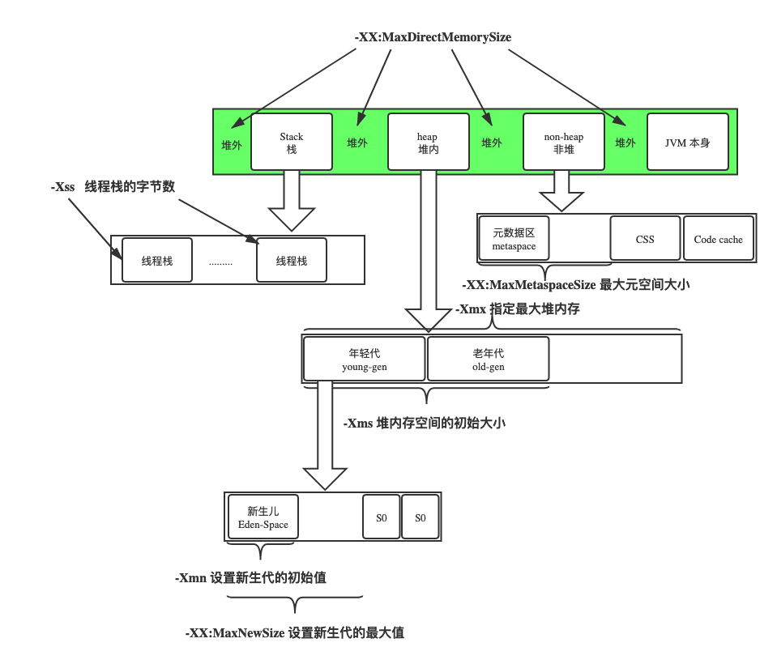

Xmx、Xms、Xmn、Metaspache、DirectMemory、Xss图：

学习笔记：

1. 字节码分析关键是对照着 https://docs.oracle.com/javase/specs/jvms/se8/html/jvms-6.html 来一步一步，文档里面的Operand Stack很有用，一个字节码会发生什么一目了然
2. 字节码跟AOP、类的动态加载卸载关系很大
3. x86跟delvik都是基于寄存器的机器，JVM是基于栈的机器
4. 自定义类加载器可以方便我们做到一些高级功能，例如字节码的混淆、加密等等
5. 刚好复习了一下two's complement：-54是没错的吧，255-bytes[i]首先把bytes[i]转成int，相减得到202，202就是0b11001010，强转一下byte型，byte是signed的，11001010的two's complement就是-54

reference：

1. https://shimo.im/docs/rcxYt6PtQgkkyd8h
2. https://shimo.im/docs/gktGqQk8QGGP8gqR/read
3. [HotSpot虚拟机运行时系统](https://github.com/cncounter/translation/blob/master/tiemao_2019/15_HotSpot_Runtime_Overview/README.md)
4. [Why Should I Know About Java Bytecode](https://jrebel.com/rebellabs/rebel­labs­report­mastering­java­bytecode­at­the­core­of­the­jvm/)
5. [轻松看懂Java字节码](https://juejin.im/post/5aca2c366fb9a028c97a5609)
6. [invokedynamic指令](https://www.cnblogs.com/wade­luffy/p/6058087.html)
7. [Java 8的Lambda表达式为什么要基于 invokedynamic?](https://www.zhihu.com/question/39462935)
8. [Invokedynamic](https://www.jianshu.com/p/ad7d572196a8)
9. [JVM之动态方法调用:invokedynamic](https://ifeve.com/jvm%E4%B9%8B%E5%8A%A8%E6%80%81%E6%96%B9%E6%B3%95%E8%B0%83%E7%94%A8%EF%BC%9Ainvokedynamic/)

