## Serial GC

java -Xmx1g -Xms1g -XX:-UseAdaptiveSizePolicy -XX:+UseSerialGC -XX:MaxGCPauseMillis=50 -Xloggc:/tmp/gc.log -XX:+PrintGCDetails -XX:+PrintGCDateStamps -jar gateway-server-0.0.1-SNAPSHOT.jar

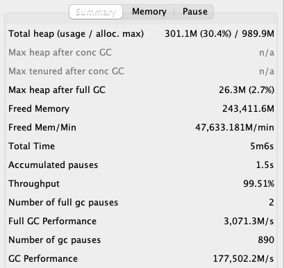

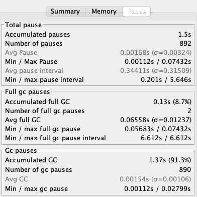

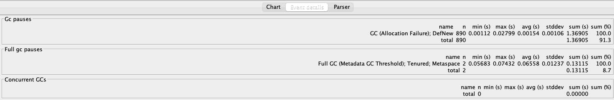

## Parallel GC

java -Xmx1g -Xms1g -XX:-UseAdaptiveSizePolicy -XX:+UseParallelGC -XX:MaxGCPauseMillis=50 -Xloggc:/tmp/gc.log -XX:+PrintGCDetails -XX:+PrintGCDateStamps -jar gateway-server-0.0.1-SNAPSHOT.jar

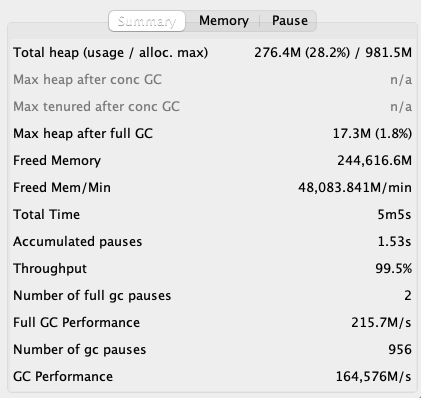

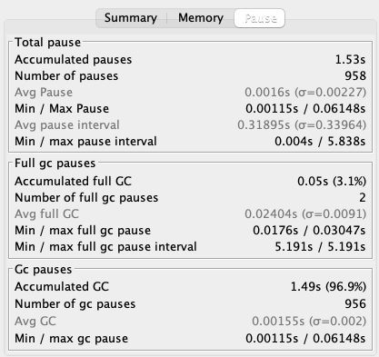

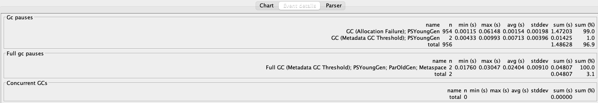

## CMS GC

java -Xmx1g -Xms1g -XX:-UseAdaptiveSizePolicy -XX:+UseConcMarkSweepGC -XX:MaxGCPauseMillis=50 -Xloggc:/tmp/gc.log -XX:+PrintGCDetails -XX:+PrintGCDateStamps -jar gateway-server-0.0.1-SNAPSHOT.jar

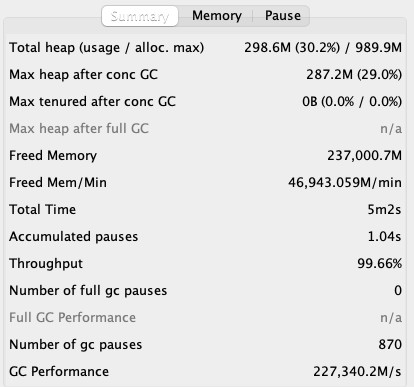

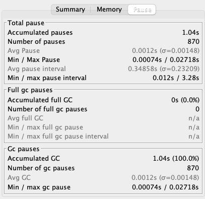

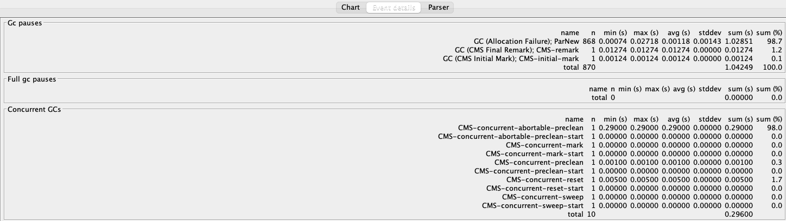

## G1 GC

java -Xmx1g -Xms1g -XX:-UseAdaptiveSizePolicy -XX:+UseG1GC -XX:MaxGCPauseMillis=50 -Xloggc:/tmp/gc.log -XX:+PrintGCDetails -XX:+PrintGCDateStamps -jar gateway-server-0.0.1-SNAPSHOT.jar

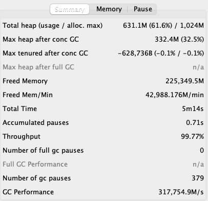

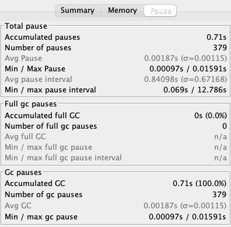

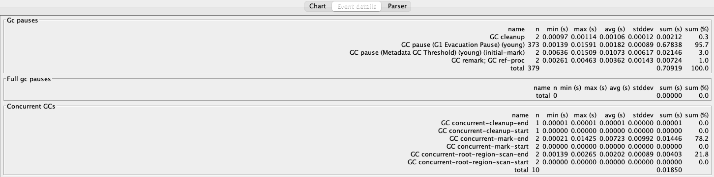